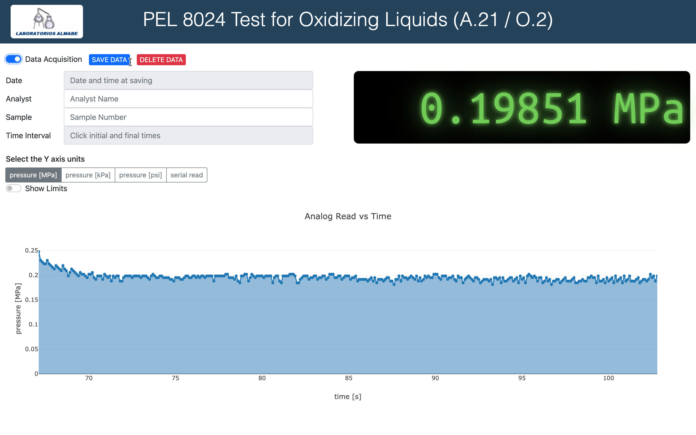

# BOOM

Data acquisition software for the Arduino analog input to measure the combustion efficiency in the PEL 8024 Test for Oxidizing Liquids (A.21 / O.2).

The data acquisition is done using the [Web Serial API](https://developer.mozilla.org/en-US/docs/Web/API/Web_Serial_API).

## How to use it

#### Prepare your Arduino
1. Download and install the Arduino IDE so that you can upload libraries to your Arduino (in  https://www.arduino.cc/en/main/software go to "Download the Arduino IDE").

2. Connect the Arduino via usb to the computer, open the file `arduino/firmware/firmware.ino` in the Arduino IDE and press the button `upload` (or go to the menu `Sketch > Upload`) and wait till the library is fully uploaded to the Arduino.

3. Close the IDE program. Your hardware is ready.

#### Acquisition software
1. Go to [https://chumo.github.io/BOOM/index.html](https://chumo.github.io/BOOM/index.html).

2. Press `CONNECT TO SERIAL` and select the serial port where your Arduino is connected.

3. Start the data acquisition by turning the corresponding switch on.

4. By clicking on the plot, it is possible to place two time points marking a time interval to be used as the main output of the experiment.

## Screenshots:

#### Acquisition panel

#### Save dialog

> Jesús Martínez-Blanco

> jmb.jesus@gmail.com
